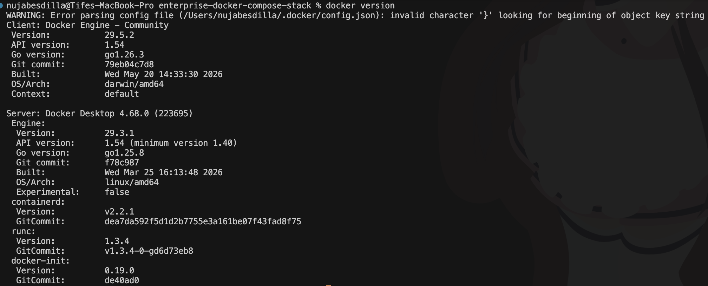
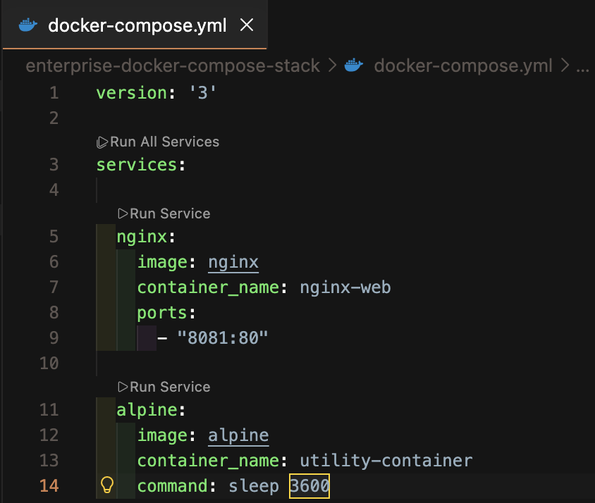
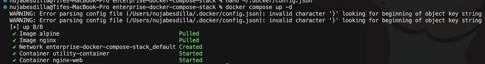
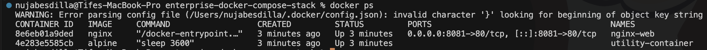
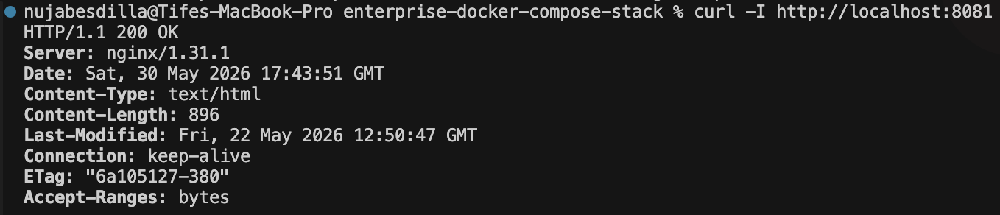
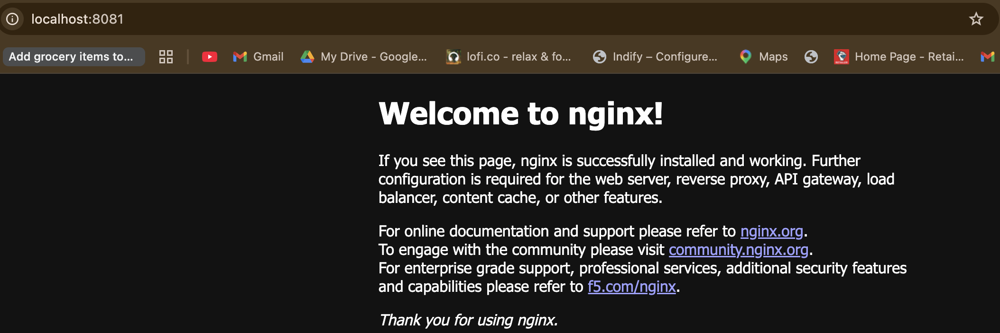

# Enterprise Docker Compose Stack

## Overview

Deployed a multi-container infrastructure stack using Docker Compose.

This project demonstrates container orchestration, service management, port mapping, and local infrastructure validation using Docker and NGINX.

---

## Architecture

```text
Client
   ↓
NGINX Container
   ↓
Docker Compose Network
   ↓
Utility Container
```

---

## Technologies Used

- Docker
- Docker Compose
- NGINX
- Alpine Linux
- Bash
- VS Code

---

## Tasks Completed

- Created a Docker Compose configuration
- Removed obsolete Compose version syntax
- Started Docker Desktop daemon
- Deployed multiple containers
- Validated running container services
- Tested HTTP connectivity
- Documented the workflow with screenshots

---

## Commands Used

```bash
docker version
docker info
docker compose up -d
docker ps
curl -I http://localhost:8081
docker compose down
```

---

## Troubleshooting

### Issue

Docker returned the following error:

```text
failed to connect to the docker API
check if the daemon is running
```

### Root Cause

Docker Desktop was not running, so the Docker daemon was unavailable.

### Resolution

Started Docker Desktop, verified Docker daemon status using `docker version` and `docker info`, then reran Docker Compose successfully.

---

## Screenshots

### Docker Daemon Running



---

### Docker Compose Configuration



---

### Docker Compose Deployment



---

### Running Containers



---

### HTTP Validation



---

### Browser Validation



---

## What I Learned

- How to troubleshoot Docker daemon connection errors
- How to deploy multi-container infrastructure with Docker Compose
- How to validate containerized web services
- How to document real DevOps troubleshooting workflows